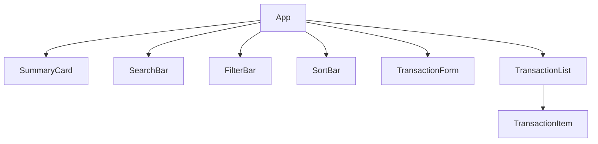
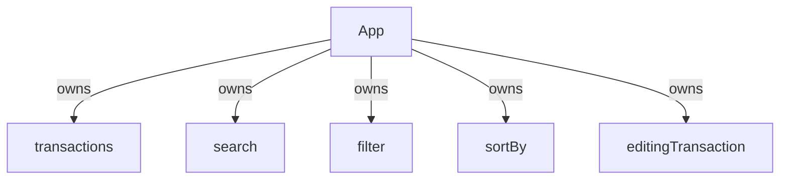
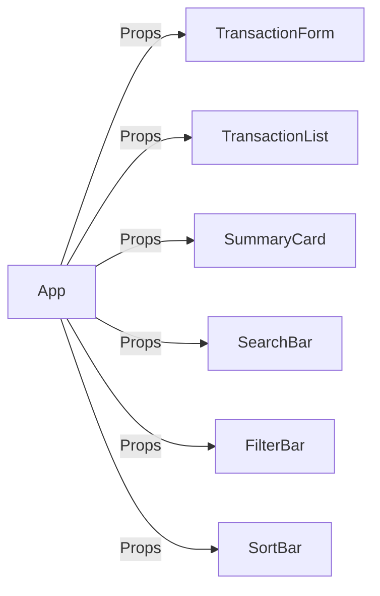
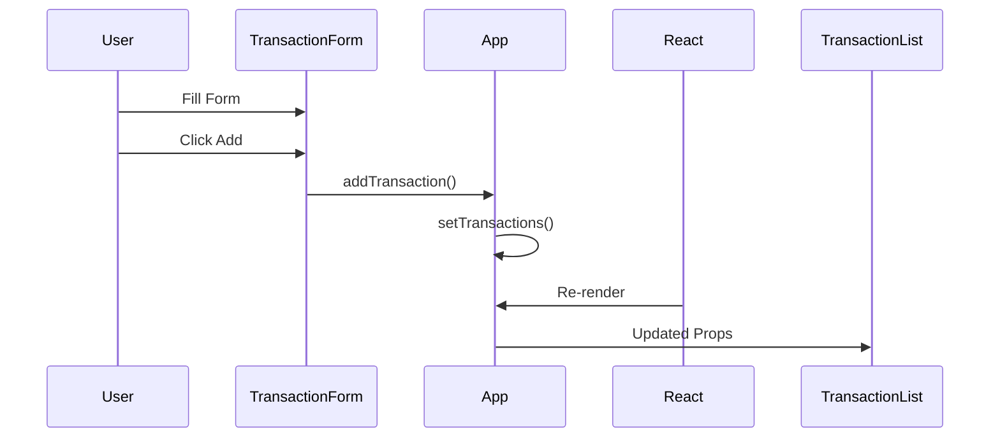
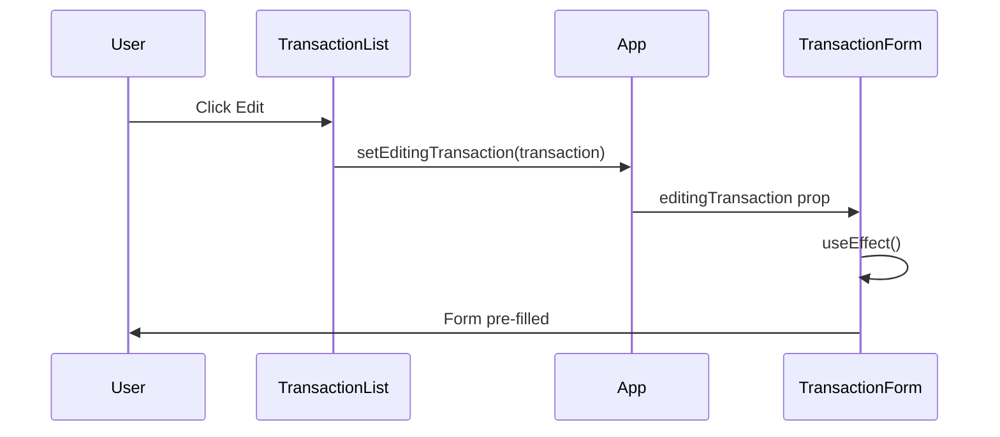
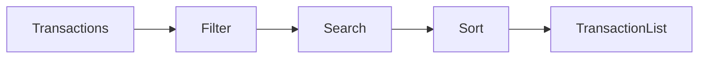
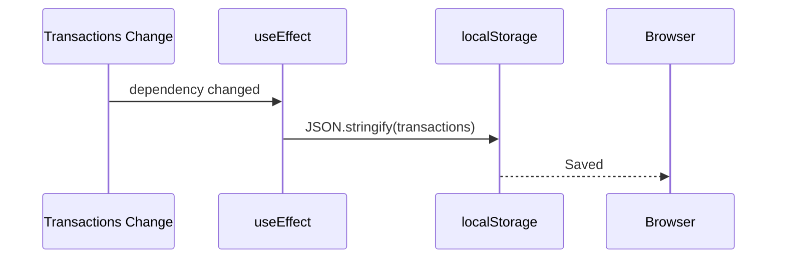

# 🧠 How React Works in SmartSpend

This project helped me understand React's one-way data flow, state management, and rendering cycle.

---

## 1. Component Hierarchy

The application is divided into reusable components.



The **App** component acts as the central controller and owns the application's state.

---

## 2. State Ownership

Instead of storing data in multiple components, all important state lives inside **App**.



This follows React's principle:

> Lift state to the closest common parent.

---

## 3. One-Way Data Flow

React data always flows from parent to child.



Children never modify parent state directly.

Instead they call callback functions passed through props.

---

## 4. Event Flow

```mermaid
flowchart TD

User Click

User Click --> Child Component

Child Component --> Callback Function

Callback Function --> setState()

setState() --> React

React --> Re-render

Re-render --> Updated UI
```

Every button in the application follows this same cycle.

---

## 5. Add Transaction



React updates the UI automatically after the state changes.

---

## 6. Edit Transaction



The form is synchronized using `useEffect` whenever `editingTransaction` changes.

---

## 7. Update Transaction

```mermaid
flowchart TD

Old Array

Old Array --> map()

map() --> Replace Matching Object

Replace Matching Object --> New Array

New Array --> setTransactions()

setTransactions() --> React Re-render
```

The application uses **map()** because updating replaces one object while preserving the array length.

---

## 8. Delete Transaction

```mermaid
flowchart TD

Old Array

Old Array --> filter()

filter() --> Remove Matching Object

Remove Matching Object --> New Array

New Array --> setTransactions()

setTransactions() --> React Re-render
```

The application uses **filter()** because deleting removes an item from the array.

---

## 9. Search → Filter → Sort Pipeline



The displayed transactions are never stored separately.

They are derived from the original array during every render.

---

## 10. Balance Calculation

```mermaid
flowchart TD

Transactions

Transactions --> reduce()

reduce() --> Income

reduce() --> Expense

Income --> Balance

Expense --> Balance

Balance --> SummaryCard
```

Instead of storing balance as state, it is derived using `reduce()`.

This avoids inconsistent data.

---

## 11. Local Storage Synchronization



Whenever the transactions array changes, React automatically persists the latest data.

---

## 12. React Rendering Cycle

This is the most important concept I learned during the project.

```mermaid
flowchart TD

User Action

User Action --> Event Handler

Event Handler --> setState()

setState() --> React

React --> Component Re-render

Component Re-render --> New Props

New Props --> Updated UI
```

Every feature in SmartSpend—Create, Read, Update, Delete, Search, Filter, and Sort—follows this exact lifecycle.