# 🧠 How React Works in SmartSpend

This project helped me understand React's **one-way data flow**, **state management**, **component communication**, and **React's rendering cycle**.

---

# 1. 🧩 Component Hierarchy

The application is divided into reusable components.

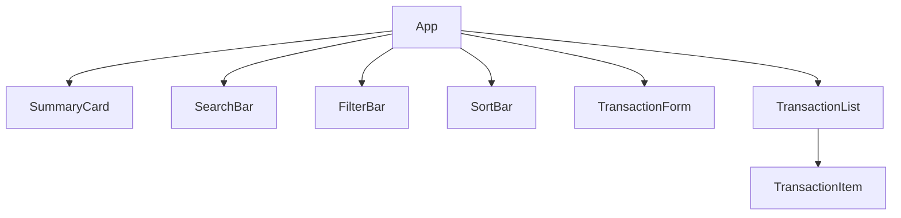

### Explanation

- `App` is the root component.
- It owns all the application state.
- Child components receive data through props.
- `TransactionList` renders multiple `TransactionItem` components.

---

# 2. 📦 State Ownership

Instead of storing state in multiple components, all important state is managed by `App`.

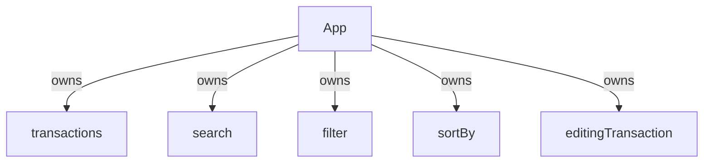

### Explanation

React recommends **lifting state to the closest common parent**.

This allows multiple components to share and update the same data.

---

# 3. 🔄 One-Way Data Flow

React data always flows from parent to child.

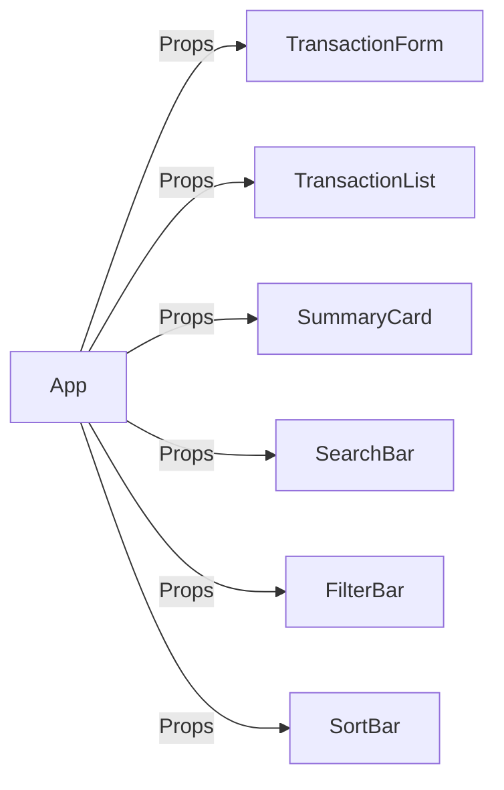

### Explanation

Child components never modify state directly.

Instead they call callback functions provided by the parent.

---

# 4. ⚡ Event Flow

Every button in the application follows this cycle.

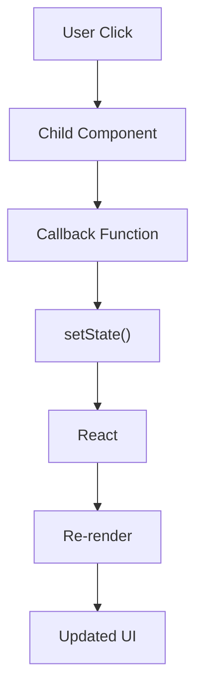

### Explanation

1. User interacts with the UI.
2. Child component calls a callback.
3. Parent updates state.
4. React re-renders.
5. UI updates automatically.

---

# 5. ➕ Add Transaction Flow

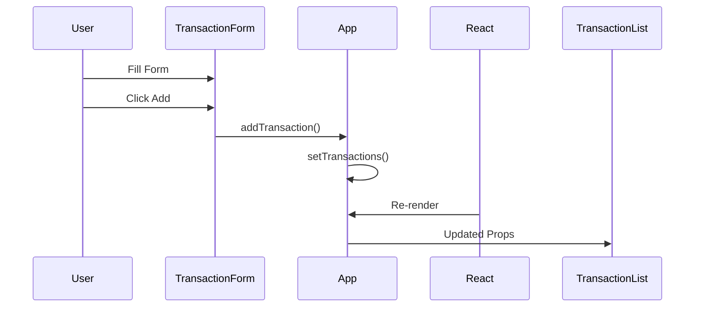

### Explanation

- The form creates a transaction object.
- It sends the object to `App`.
- `App` updates the transactions array.
- React automatically refreshes the UI.

---

# 6. ✏️ Edit Transaction Flow

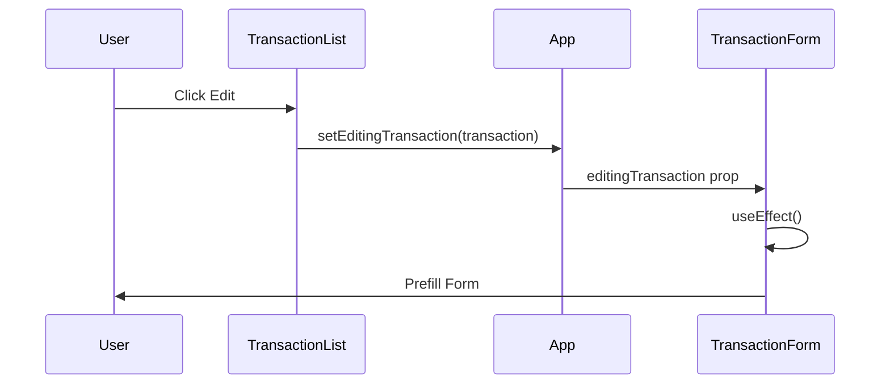

### Explanation

When a transaction is selected:

- App stores it in `editingTransaction`.
- Form receives it as a prop.
- `useEffect` updates the input fields automatically.

---

# 7. 💾 Update Transaction Flow

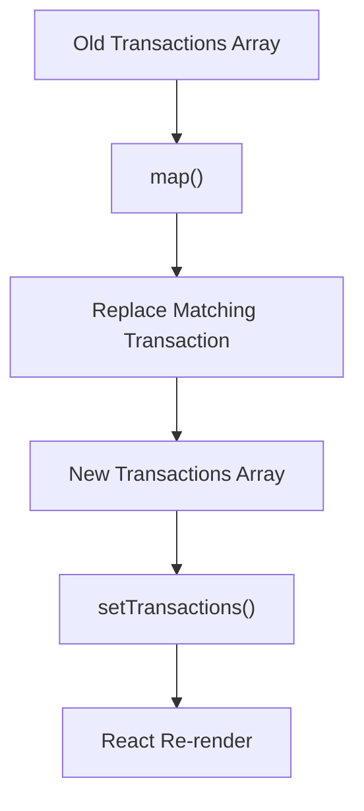

### Explanation

`map()` creates a **new array**.

Only the matching transaction is replaced.

Everything else remains unchanged.

This keeps React state immutable.

---

# 8. ❌ Delete Transaction Flow

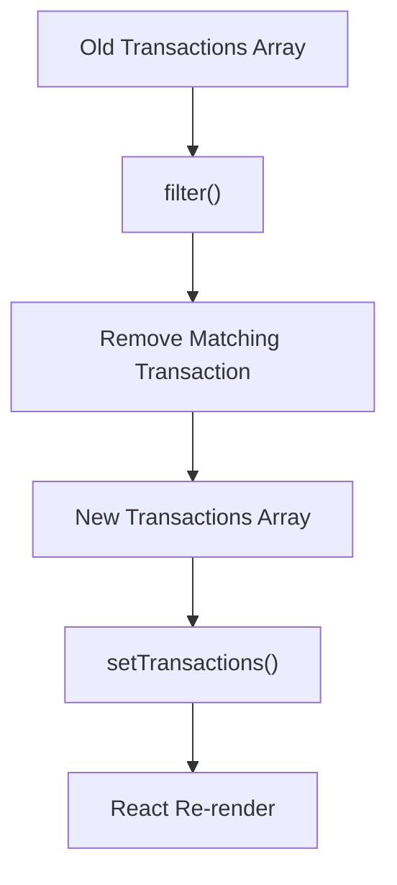

### Explanation

`filter()` removes the selected transaction.

A new array is created and React re-renders automatically.

---

# 9. 🔍 Search → Filter → Sort Pipeline

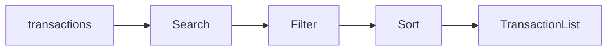

### Explanation

Transactions displayed on the screen are derived every render.

Pipeline:

1. Search
2. Filter
3. Sort
4. Display

No extra state is stored.

---

# 10. 📊 Balance Calculation

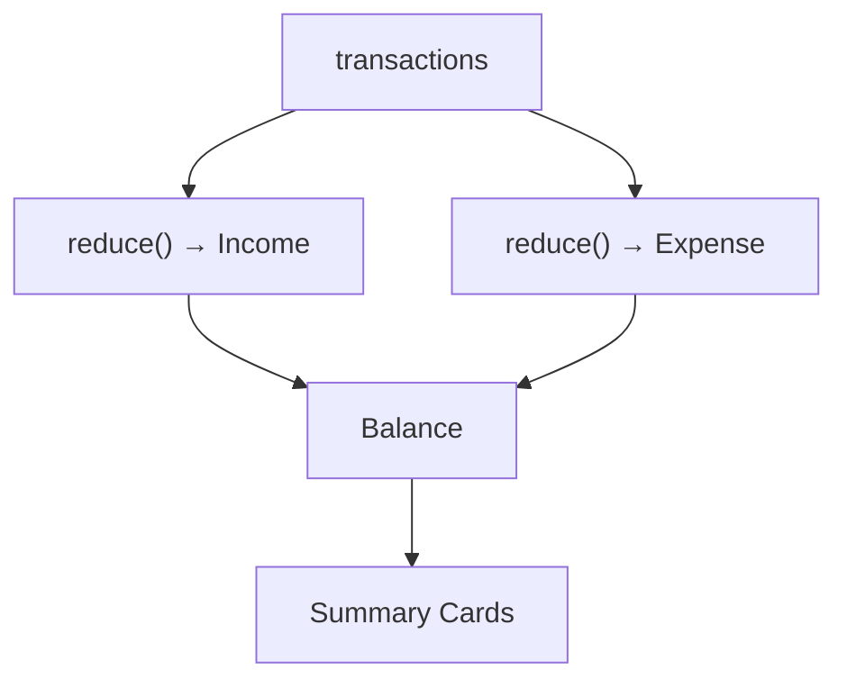

### Explanation

Balance is derived instead of stored.

```javascript
Balance = Initial Balance + Income - Expense
```

Using derived state avoids inconsistent values.

---

# 11. 💾 Local Storage Synchronization

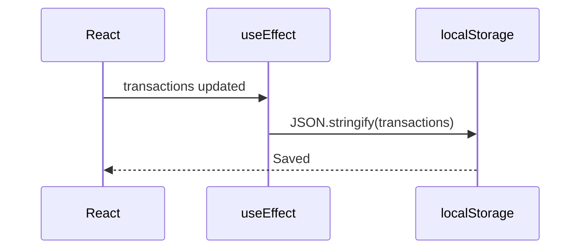

### Explanation

Whenever `transactions` changes,

`useEffect` automatically saves the latest data to Local Storage.

---

# 12. ⚛️ React Rendering Cycle

This is the core concept behind every feature in the application.

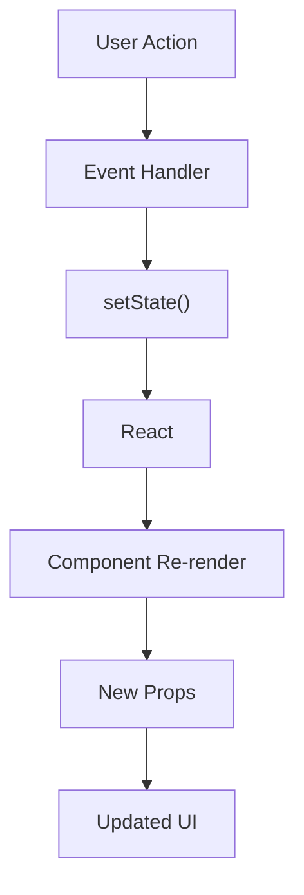

### Explanation

Every feature in SmartSpend follows the same lifecycle:

1. User performs an action.
2. Event handler executes.
3. State changes using `setState`.
4. React detects the change.
5. Components re-render.
6. New props are passed to children.
7. UI updates automatically.

---

# 🎯 Key React Concepts Learned

- Functional Components
- Component Composition
- Props
- State (`useState`)
- Side Effects (`useEffect`)
- Controlled Components
- Event Handling
- Conditional Rendering
- List Rendering with `map()`
- Removing items with `filter()`
- Updating items with `map()`
- Derived State using `reduce()`
- Lifting State Up
- One-Way Data Flow
- Immutable State Updates
- Local Storage Persistence
- React Re-rendering
- CRUD Operations

---

# 📚 Summary

This project demonstrates how a medium-sized React application is structured using **state lifting**, **reusable components**, and **one-way data flow**.

Every feature—**Create**, **Read**, **Update**, **Delete**, **Search**, **Filter**, and **Sort**—follows the same React lifecycle:

**User Action → Event Handler → State Update → React Re-render → Updated UI**

Understanding this pattern was the biggest takeaway from building SmartSpend.